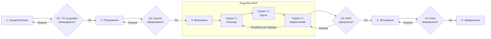

# Життєвий цикл проєкту

## 1. Обрана модель життєвого циклу

* **Конкретна модель:** Scrum.
* **Тип моделі за сучасною класифікацією:** Адаптивна / Гнучка.
* **Обґрунтування вибору:** Екосистема для студентів НУБіП є стартап-проєктом, де критично важливо швидко випустити базовий продукт і тестувати його на реальній аудиторії. Scrum дозволяє розбити складний проєкт на логічні частини та швидко адаптувати функціонал на основі фідбеку від студентів без втрати загального прогресу.

## 2. Фази життєвого циклу

| № | Назва фази | Мета фази | Тривалість (тижнів) | Ключові роботи | Deliverables (проміжні результати) | Відповідальний |
|---|---|---|---|---|---|---|
| 1 | **Концептуальна** | Визначення меж проєкту, ЦА та ключового функціоналу | 2 | Аналіз проблеми навігації НУБіП, формування вимог до маркетплейсу, проєктування UI/UX, розробка ER-моделі БД | ТЗ, Vision-документ, архітектура БД, макети екранів | Project Manager / Business Analyst |
| 2 | **Планування** | Підготовка до розробки, налаштування інфраструктури | 1 | Розбиття вимог на User Stories, формування Product Backlog, налаштування серверного середовища | Product Backlog, готові CI/CD пайплайни, середовище розробки | Team Lead / Software Architect |
| 3 | **Виконання** | Нарощування функціоналу через серію ітерацій | 6 | Спринт 1: Авторизація та розклад. Спринт 2: Інтерактивна карта кампусу. Спринт 3: Локальний маркетплейс. | Робочі інкременти застосунку після кожного спринту | Frontend та Backend розробники |
| 4 | **Тестування** | Перевірка працездатності в реальних умовах кампусу | 2 | QA-тестування, перевірка GPS-навігації між корпусами, навантажувальне тестування маркетплейсу | Баг-репорти, оптимізований код, реліз-кандидат | QA Engineer |
| 5 | **Завершення** | Введення в експлуатацію та передача цільовій аудиторії | 1 | Деплой на продакшн-сервер, публікація мобільного застосунку, підготовка презентації | Готовий до використання застосунок, фінальна презентація проєкту | Project Manager / Team Lead |

## 3. Ворота між фазами

| Ворота | Між фазами | Критерії переходу | Можливі рішення |
|---|---|---|---|
| **G1** | Фаза 1 → Фаза 2 | Затверджені макети дизайну, узгоджено стек технологій та архітектуру бази даних. | Go / Rework / Kill |
| **G2** | Фаза 2 → Фаза 3 | Сформовано пріоритезований Product Backlog, середовище розробки повністю налаштоване та готове. | Go / Rework / Kill |
| **G3** | Фаза 3 → Фаза 4 | Усі заплановані фічі MVP інтегровані та проходять базові Unit-тести. | Go / Rework / Kill |
| **G4** | Фаза 4 → Фаза 5 | Критичні баги відсутні, тестування навігації на території кампусу успішне. | Go / Rework / Kill |

## 4. Візуалізація життєвого циклу

Обґрунтування вибору моделі
На вибір моделі безпосередньо вплинув інноваційний та орієнтований на користувача характер нашого проєкту. Оскільки застосунок вирішує щоденні проблеми студентів, ми очікуємо, що під час розробки вимоги до UI/UX та бізнес-логіки можуть змінюватися на основі реального досвіду користувачів. Адаптивна модель Scrum дозволяє нам бути гнучкими: замість того, щоб чекати місяці на фінальний реліз, ми зможемо випустити модуль навігації вже після перших ітерацій і віддати його на тестування.

На етапі планування також розглядалися альтернативні класичні моделі. Наприклад, каскадна модель була відхилена через її жорсткість: у ній майже неможливо безболісно повернутися до зміни дизайну карти, якщо під час розробки з'ясується, що маркери корпусів відображаються незручно. V-подібна модель також виявилася занадто складною та бюрократизованою для проєкту з невеликою командою.

Головною перевагою Scrum для нашої екосистеми є інкрементальний підхід та швидкий зворотний зв'язок. Розбиття на короткі спринти дозволяє команді зберігати мотивацію, постійно бачачи працюючий результат своєї роботи.

Проте ми усвідомлюємо і ризики такої моделі — насамперед розростання обсягу робіт, коли через нові ідеї студентів чи викладачів проєкт може вийти за часові рамки. Щоб мінімізувати цей ризик, команда суворо дотримуватиметься пріоритезації за методом MoSCoW, допускаючи в перші ітерації лише обов'язковий функціонал та відкладаючи другорядні фічі на етап пост-релізної підтримки.
